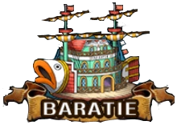

# site-baratie
# site-baratie
# Baratie - Página Web do Restaurante

Bem-vindo à página web do restaurante *Baratie*, onde você encontrará informações sobre nosso restaurante, cardápio e serviços. Desfrute de uma experiência gastronômica autêntica!

## Sobre o Restaurante

Imagine-se a bordo de um navio flutuante, com o aroma delicioso de pratos frescos no ar e o som dasondas do mar ao fundo. Este somos nós, o *Baratie*, onde aventura e gastronomia se encontram. O Baratie é mais do que apenas um restaurante; é um refúgio no mar, onde navegantes e piratas podem encontrar repouso e delícias culinárias. Nosso destaque são os pratos lendários, de sopas de curry perfeitamente temperadas a peixes grelhados frescos que derretem na boca.Além disso, o Baratie é conhecido por sua hospitalidade, e o ambiente é acolhedor. No entanto, não se assustem, caso de repente, uma batalha se inicie, pois o restaurante atrai frequentemente a atenção de piratas e marinheiros ambiciosos resultando em algumas batalhas emocionantes. Assim, o Baratie é uma experiência inesquecível, onde você pode satisfazer seu paladar com iguarias incríveis e se envolver em aventuras que você só encontraria no mundo aqui. É uma parada obrigatória para qualquer viajante destemido nos mares vastos e misteriosos de toda East blue.

## Menu

Navegue pelo nosso menu variado, que inclui:

- *MentirosoHonrado*: Uma das deliciosas entradas do nosso restaurante.
- *BençãodeEastBlue*: Um dos pratos principais mais pedido do nosso restaurante.
- *Laranjeiras*: Uma das sobremesas tentadoras do nosso cardápio, como também BaraBaraNoMi e LindaDama.

Consulte o menu completo através do nosso site.

## Horário de Funcionamento

Estamos abertos todos os dias da semana, das 11h30 às 23h. Venha nos visitar para um almoço agradável ou um jantar romântico.

## Localização

- *Endereço*: Rua da Itália, 133, Cidade das Delícias, IT
- 
## Galeria de Fotos

Explore nosso álbum de fotos dos nossos pratos para uma amostra visual dos pratos deliciosos e do ambiente acolhedor do restaurante.

## Avaliações

Confira o que nossos clientes têm a dizer sobre nós nos app vizinhos.

## Fale Conosco

- *Telefone*: (71) 94956-7890
- *E-mail*: info@baratie.com
- Redes Sociais: Siga-nos nas redes sociais.

## Agradecimentos

Agradecemos por visitar a página web do *Baratie*. Esperamos vê-lo em breve em nosso restaurante para desfrutar da autêntica culinária.
